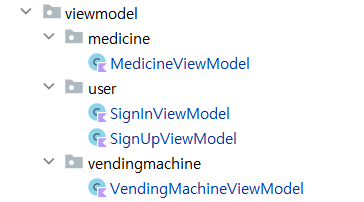

# 약톡톡 프론트엔드 (ytt Front-End)

<!-- ABOUT THE PROJECT -->
## 프로젝트 개요
<br>
### 개발 환경
<br>

- IDE: Android Studio
- 프로그래밍 언어: Kotlin
- SDK: Android minSDK 
- 버전: Android 5.0 이상
- 기타 도구: Git (버전 관리)


### 개발 기술 

- 지도 API: 네이버 지도를 사용하기 위해 Naver Cloud Api를 사용하여 지도 개발
- UI 설계: XML 레이아웃 파일을 사용하여 사용자 인터페이스 디자인
- 네트워킹: Retrofit 라이브러리를 이용한 API 호출
- 데이터 관리: SharedPreference를 사용하여 데이터 관리
- 암호화: HashKey로 암호화하여 비밀번호 외부 유출 방지
- 서버에서 사용되는 엔드포인트 주소를 local.properties에서 다음과 같이 사용
```
NAVERMAP_CLIENT_ID = aipi7vjj4g
BaseUrl = "http://13.125.128.15:8080"
SubUrl = "ws://13.125.128.15:8080"
```
<p align="right">(<a href="#프로젝트-개요">back to top</a>)</p>

## 프로젝트 구조 (Architecture)
- 아키텍처 (프로젝트 전체 구조)
- MVVM 아키텍처: Model-View-ViewModel 패턴을 적용하여 코드의 유지보수성과 테스트 용이성을 향상
- Model: 데이터 및 비즈니스 로직 처리
- View: UI 구성 요소 (Activity, Fragment)
- ViewModel: UI와 Model 간의 데이터 연결 및 비즈니스 로직 처리

#### Model
           
- user, medicine, vendingmachine, order로 나누어져있습니다.
#### network
      
- ApiService에는 서버 경로, RetrofitAPI에는 Retrofit 관련 라이브러리 관련 파일이 저장되어 있습니다.
- 토큰, 웹소켓 관련 클래스가 포함되어 있습니다.

#### repository
             
- repository에는 auth, medicine, Order, Vendingmachine Repository로 관련 메서드들을 관리합니다.
 
#### View
       
- user, medicine, order, vendingmachine 과 하단 4개 탭과 관련한 Fragment로 구성되어 있습니다.

#### ViewModel

- UI와 Model 간의 데이터 연결 및 비즈니스 로직 처리를 진행합니다. 

## 상세 기능

##### 회원 로그인 기능

     
      
- 회원 가입 시 사용한 아이디와 비밀번호를 사용하여 회원 로그인을 진행할 수 있습니다.
         
#### 자판기 조회 기능

      
        
- 사용자가 거리 상에 있는 목록을 조회할 수 있는 기능입니다.
- UI: 거리 상에 있는 자판기의 이름과 위치가 지도에 나타고 하단 바텀 시트에는 자판기 목록이 그리드 형태로 표시되며
각 자판기의 이름, 위치, 운영상태가 함께 나타납니다.


##### 약 조회 기능
        

       
- 사용자가 자판기에서 판매중인 약 목록을 조회할 수 있는 기능입니다.
- UI: 약 목록이 그리드 형태로 표시되며, 약의 이미지와 가격 상품코드가 함께 나타납니다.

#### 즐겨찾기 기능


      
- 최상단의 하트를 누르면 즐겨찾기 추가가 되며 즐겨찾기 탭에서 즐겨찾기한 자판기를 따로 확인할 수 있습니다.


#### 약 선택 및 약 상세 기능 설명 기능
       

- 사용자가 원하는 약을 선택하면 약에 대한 상세 정보를 알 수 있고 원하는 수량만큼을 조절해서 담기 버튼을 통해 구매할 목록에 추가할 수 있습니다.
- UI: 선택된 상품이 구매할 약 목록에 추가됩니다.
       
#### 약 주문하기 및 취소하기 기능


- 사용자가 선택한 약을 주문할수 있는 기능입니다.


- 약 이름, 가격, 주문 수량을 확인할 수 있으며 주문하기 버튼을 누르면 자판기에 입력할 수 있는 QR 코드가 생성됩니다.
- 주문한 약을 취소할 수 있는 기능도 포함되어 있습니다.

#### 주문 실패 시 사유 확인 기능

- 주문에 실패했을 때 그 이유를 다이얼로그로 확인 할 수 있습니다.

#### 주문 목록 확인 기능
        

- 사용자가 주문한 목록들을 전체적으로 확인할 수 있습니다.
        
#### 사용자 정보 확인, 로그아웃 기능
          

- 로그인한 사용자의 이름 정보를 확인할 수 있고 로그아웃 기능을 확인할 수 있습니다.
